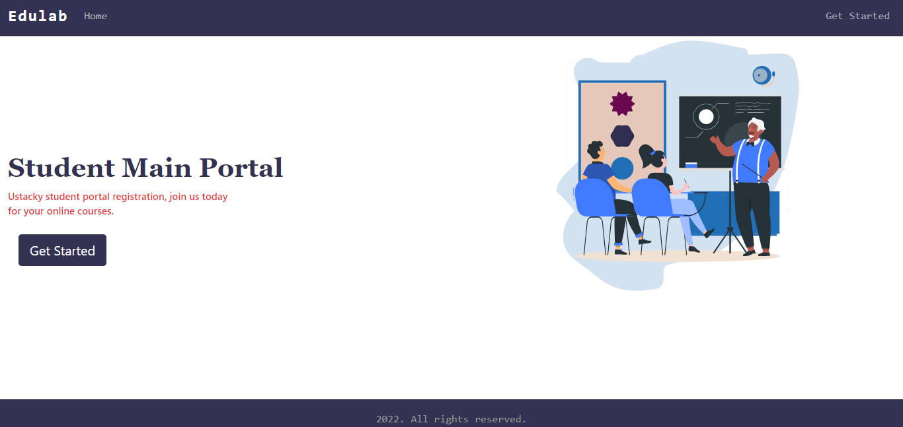
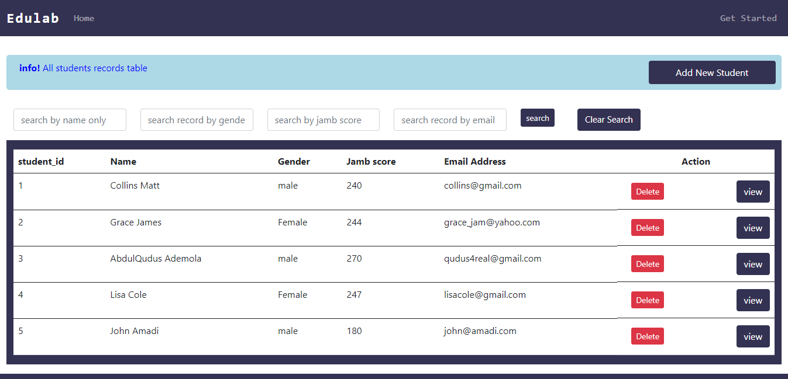
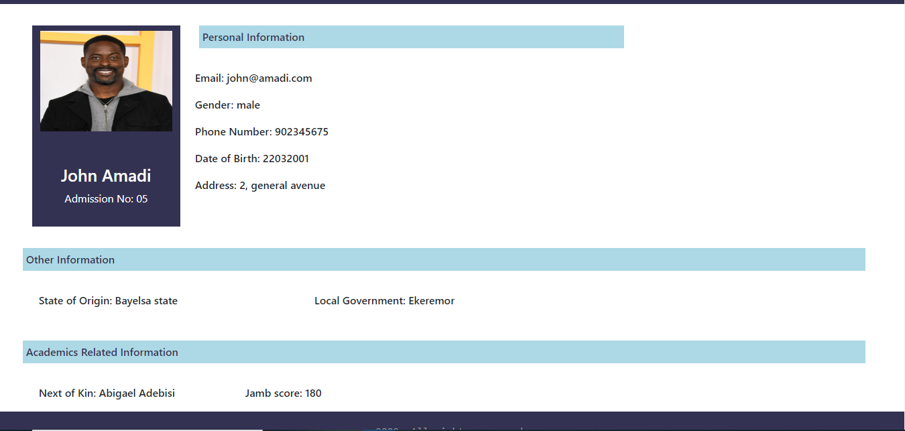

# Edulab-student-portal

full stack CRUD web application built with HTML, CSS, Bootstrap, JavaScript, Python, MySQL, and Flask framework.

## Table of contents

- [Overview](#overview)
  - [The challenge](#the-challenge)
  - [Screenshot](#screenshot)
  - [Links](#links)
- [My process](#my-process)
  - [Built with](#built-with)
  - [What I learned](#what-i-learned)
  - [Useful resources](#useful-resources)
- [To use](#usage)

## Overview

### The challenge

Users should be able to:

- Check for the meaning of words.
- Add a new word with it's meaning to the dictionary.
- Update the a and its meaning.
- Delete a word from the dictionary
- View the optimal layout for the site depending on their device's screen size

### Screenshot






### Links

- Solution URL: (https://github.com/faozziyyah/Edulab-student-portal)
- Live link: (Not yet available)

## My process

### Built with

- HTML
- CSS
- Bootstrap
- Javascript
- Ajax
- [Flask](https://flask.palletsprojects.com/en/2.1.x/) - A web development microframework built with python
- MySQL

### What I learned

- How to connect to a database
- How to use the Jinja template

```js
$( window ).on("load", function() {
    $("#myModal").modal("show");
    $("#content").hide();
    $(".update-content").hide();
    $(".edit-word, .edit-meaning").hide();
    $(".submit, .cancel").hide();
}
```

```Python
@app.route('/delete/<string:id_data>', methods =['GET'])
def delete(id_data):
    flash('student record deleted successfully')
    conn = mysql.get_db()
    cur = conn.cursor()
    cur.execute(' delete from students where student_id=%s ', (id_data))
    conn.commit()
    return redirect(url_for('students'))
```

```HTML

<tr>
    <td>{{ student['student_id'] }}</td>
    <td class="word-word">{{ student['firstname'] }} {{ student['lastname'] }}</td>
    <td class="word-meaning">{{ student['gender'] }}</td>
    <td class="word-meaning">{{ student['jambscore'] }}</td>
    <td class="word-meaning">{{ student['email'] }}</td>
</tr>
```

### Useful resources

- [Flask](https://flask.palletsprojects.com/en/2.1.x/) - A web development microframework built with python
- [MySQL](https://www.mysql.com/) - The world's most popular open source database